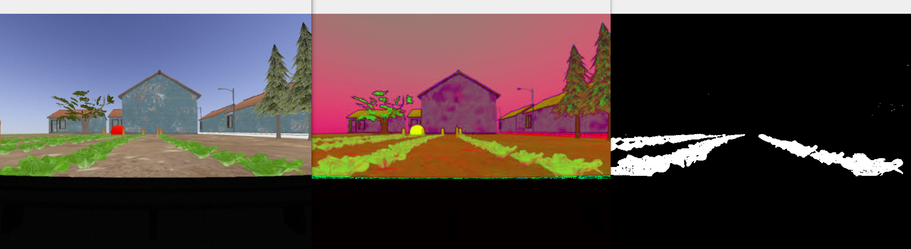

# PARC 2023 OpenCV Workshop Repository



## Instructions:

### Clone the repository
Place in same workspace as the original PARC Engineers League repository
```
cd ~/catkin_ws/src
git clone https://github.com/PARC-Robotics/opencv-workshop.git
```

### Install dependencies
In a terminal, run the commands
```
sudo apt-get install python3-opencv
sudo apt-get install ros-noetic-cv-bridge ros-noetic-vision-opencv
```

### Compile

```
cd ~/catkin_ws
catkin_make
```
### Run Python scripts
In a terminal, run the commands
```
python image_processing.py # or other scripts such as basic_img_operations.py
```

To use the color thresholding utility from [Najam Syed](https://github.com/nrsyed/computer-vision/tree/master/ColorThreshUtil) (slightly modified)
```
python colorthresh.py --image front_cam_img.jpg
```


### Run with ROS
In a terminal, run the commands
```
source ~/catkin_ws/devel/setup.bash
roslaunch parc_robot task1.launch
```

Open another terminal and run the following commands
```
source ~/catkin_ws/devel/setup.bash
roscd opencv-workshop
chmod +x scripts/ros_example.py

rosrun opencv-workshop ros_example.py
```